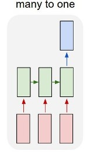
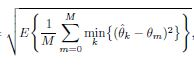

# Direction of angle estimation

DOA estimation problem has been an active area of research in the signal processing community, where I am trying to make a neural network learn the angles of arrival (AOAs) of a known number of multiple sources transmitting unknown signals.

I am using many to one LSTM as the signal data is sequential in nature to output number of angles according to the number of sources(if there are two sources, the network is expected to learn two angles)

The angle estimation loss function in case of single source is simply mean absolute error and for multiple sources is the squared root of the mean square error between the true source angle s and their closest estimation, which is mathematically expressed by

where theta m, and theta k are the true and estimated angle of arrivals,
respectively, and k can vary from 0 to no of sources-1. 
